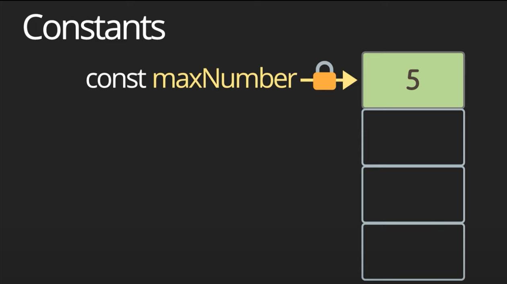
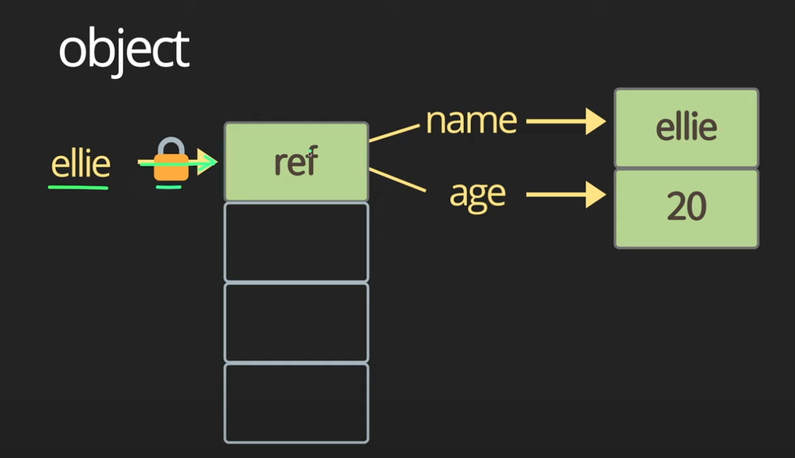

# 데이터타입, data types, let vs var, hoisting\

입력, 연산, 출력

사용자에게 콘솔이나 UI에서 입력받은 데이터를 잘 처리하고 연산해서 알맞게 사용자에게 출력하는 것이 중요하다.

물론, 데이터를 서버로 전송하고 다시 받아오는 것도 포함되어있다.

이런 연산을 하면서 CPU를 효율적으로 사용할 수 있도록 CPU에 최적화된 로직을 작성하는 것도 중요하고
메모리를 최소화해서 사용하는 것도 정말 중요한 포인트이다.

## Variable 변수

변경될 수 있는 값
let 키워드 (ES6)로 선언함

애플리케이션을 실행하게 되면 애플리케이션마다 쓸 수 있는 메모리가 제한적으로 할당된다.

그렇기 때문에 let이라는 키워드로 name변수를 정의하게 되면 하나의 박스를 가리킬 수 있는 포인트가 생기고,
name이라는 변수가 기리키고 있는 메모리 어딘가에 ellie라는 값을 저장할 수 있다.

그리고 추후에 name변수가 가리키고 있는 곳에 다른 값을 넣어 저장할 수 있게 된다.


Block scope

`{ }` 블럭을 이용해서 코드를 블럭 안에 작성하게 되면,
블락 밖에서는 더 이상 블럭 안에 있는 내용들을 볼 수 없게 된다.

```javascript
let globalName - 'global name';
{
  let name = 'ellie';
  console.log(name);
  let name = 'hello';
  console.log(name); 
}
console.log(name);  // ''
```

즉, 블럭 밖에서 블럭 안에 있는 변수에 접근을 못한다.

반대로 블럭을 사용하지 않고 자바스크립트 파일 안에 바로 사용하는 변수를 global scope이라고 하는데
이렇게 글로벌한 변수는 어느 장소에서나 접근이 가능하다

글로벌한 변수들은 애플리케이션이 실행되는 순간부터 끝날 때까지 항상 메모리에 탑재되어 있기 때문에 최소한으로 사용하는 것이 좋다.

가능하면 class, function, if, for 문같이 필요한 부분에서만 정의해서 사용하는 것이 좋다

자바스크립트에서 변수를 선언할 수 있는 키워드는 let 하나 뿐이다.
이전에는 var를 사용햇는데 지금은 사용하지 않는 것이 좋다.

### var를 쓰면 안좋은 이유 

1. 대부분의 프로그래밍 언어에서는 변수를 선언하고나서 값을 할당하는 것이 일반적인 방법이지만, 
자바스크립트에서는 변수를 선언하기도 전에 값을 할당할 수 있고
값을 할당하기도 전에 출력할 수도 있다

```javascript
console.log(age); // undefined
age = 4;
console.log(age); // 4
var age;
```

물론 let 키워드를 통해 동일한 방식으로 한다면 정상적으로 에러가 발생한다.

이러한 방식을 var hoisting 이라고 한다.
호이스팅이란, 어디에 선언되었는지 상관없이 항상 제일 위로 선언을 끌어올려주는 것을 말한다

2. var로 선언된 변수는 block scope가 없다
  
그 말은 즉슨, block을 철저히 무시한다는 것이다
블럭 안에 변수를 선언했어도 블럭 밖에서 접근이 가능하다

```javascript
{
  age = 4;
  var age;
}
console.log(age); // 4
```

초창기에는 이러한 유연성을 이용해서 프로그램을 금방 대충 짜도 동작할 수있는 애플리케이션을 만들었지만, 어느정도 규모있는 프로젝트를 하다보면 선언하지도 않은 값들이 할당되어 문제를 발생시켰다.

이러한 var의 위험부담이 있기 때문에 요즘의 개발자들은 var 키워드 대신에 let 키워드를 사용한다

최신기술을 사용할 때에는 호환성을 따져봐야하는데
이러한 ES6는 edge, firefox, chrome, safari, opera 같은 메이저 브라우저에서 모두 지원이 되기 때문에 편안하게 사용하면 된다

정말 IE에서 배포를 해야하는 상황이 발생한다면 일단 ES6버전으로 개발을 하고 BABEL을 이용해서 낮은 버전으로 배포를 하면 된다.

## Constant 상수

한 번 데이터를 할당하면 더이상 값이 변경되지 않는 데이터 타입이다.
변수는 메모리 어딘가에 할당된 박스를 가리키고 있어서 이러한 포인터를 이용해서 값을 계속 바꿔 나갈 수 있었는데
constant는 이렇게 가리키고 있는 포인터가 잠겨있기 때문에 값을 선언함과 동시에 값을 할당한 뒤로는 절대 값을 변경할 수 없다



값을 계속 변경할 수 잇는 것을 Mutable Data Type이라고 하는데
이전에 살펴본 let 키워드로 선언된 변수도 이에 포함된다

하지만 Constant는 값 변경이 불가능하기 때문에 Immutable Data Type이라고 불린다.

이러한 특성 때문에 대부분의 개발자들이 Immutable Data Type을 선호하라고 하는데 즉, 웬만하면 값을 할당한 다음 다시는 변경하지 않는 데이터 타입을 사용하라는 말이다.

> 이유

1. 보안상의 이유 : 한번 작성한 값을 다른 해커들이 이상한 값으로 변경하는 것을 방지할 수 있다

2. 스레드 안전
   1. 애플리케이션이 실행되면 한 가지의 프로세스가 할당이 되고 그 프로세스 안에서는 다양한 스레드가 동시에 돌아가면서 애플리케이션을 조금 더 효율적으로 빠르게 동작할 수 있도록 도와준다.
   2. 다양한 스레드들이 동시에 변수에 접근해서 값을 변경할 수있는데 이와 동시에 값을 변경한다는 것은 위험하기 때문에 가능하면 이렇게 값이 변하지 않는 것을 사용하는 것이 좋다

3. 나중에 코드를 변경할 때 실수로 다른 값으로 변경하는 실수를 방지할 수있다

## Variable Types

### Primitive Type

더 이상 작은 단위로 나누어질 수 없는 한 가지의 아이템
숫자, 문자열, 불리언, null, undefined, Symbol

#### 1. Number 

> #### C언어에서의 Number

이와 비교해서 C언어인 경우 low-lavel 언어라고도 불린다 
왜냐하면 개발자들이 프로그램을 짜면서 조금 더 세세하게 메모리를 관리할 수 있기 때문이다

그 말은 내가 이정도 사이즈의 메모리를 할당해야 한다는 것이 가능하다는 말이다.

그래서 숫자와 관련된 변수만 보더라도 아래와 같이 다양한 것을 확인할 수 있다

```c
imt main() {
  short a = 12; // 2 bytes
  int b = 12; // 4 bytes
  long c = 1234; // 8 bytes
  float d = 1.2f; // 4 bytes
  double e = 8.2; // 16 bytes
  return 0;
}
```

 `short, int, long` 은 정수를 할당할 때 사용하고
 `float, double` 은 소수점이 있는 실수들을 할당할 때 많이 쓰인다.
 이 또한 내가 얼마나 큰 사이즈의 데이터를 담느냐에 따라 사전에 생각을 해서 변수를 할당해야 한다.
 만약 내가 한 반에 들어가는 학생 수를 다루는데 long 이라는 데이터타입을 사용한다는 것은 굉장한 메모리를 낭비하는 것이기 때문에 `short나 int` 같은 데이터 타입을 사용하는 것이 적합하다.

> #### Java에서의 Number

 마찬가지로 Java 에도 숫자에만 관련된 데이터 타입이 굉장히 많다.
 그래서 작성하기 전에 알마나 큰 양의 데이터를 저장해야 되는지 한 번 더 생각한 다음에 선언해야 된다

```java
 class Main {
   public static void main(String[ ] args) {
     byte a = 12;
     short b = 12;
     long c = 12;
     int d = 12;
     float e = 1.2f;
     double f = 1.2;
   }
 }
```

> #### Javascript에서의 Number

 다행히 자바스크립트에서는 number이라는 데이터 타입 하나만 존재하기 때문에 얼마나 큰 사이즈를 할당할건지 전혀 생각할 필요가 없다

 뿐만 아니라 자바스크립트에서는 변수를 선언할 때 데이터 타입을 따로 명시하지 않아도 되는데 그 이유가 자바스크립트에서는 데이터 타입이 다이나믹하게 결정이 되기 때문이다

 TypeScript에서는 아래와 같이 데이터타입을 명확하게 명시해서 작성해야 한다

 ```typescript
 let a: number = 12;
 let b: number = 1.2;
 ```

 하지만 이러한 number이라는 Data Type에서도 조금 특별한 값이 미리 정해져 있는데, 대부분의 프로그래밍 언어에서도 동일하게 적용되는 것이다.

 ```javascript
const infinity = 1 / 0; // Infinity
const negativeInfinity = -1 / 0; // -Infinity
const NaN = 'not a number' / 2; // NaN
 ```

이러한 3가지의 특별한 숫자값이 중요한 이유는 DOM요소를 자바스크립트를 이용해서 position을 바꾸거나 다양한 계산을 해야할 때 나누고자 하는 값이 0인지 아닌지, 숫자인지 아닌지 확인을 하지 않고 바로 연산을 하게 되면 숫자가 아닌 Infinity이나 NaN(Not a Number)를 반환할 수 있기 때문에 사용자에게 에러가 발생할 수 있기 때문이다

그래서 항상 연산할 때 그 값이 유효한 값인지 확인하고 연산하는 것이 중요하다
실제 현업에서도 이런 경우 때문에 에러가 발생하는 경우가 간혹 있다

자바스크립트에서 number는 `-2^53 ~ 2^53` 까지의 범위의 숫자만 표현이 가능한데 최근에 `bigInt` 라는 데이터 타입이 새로 추가가 되었다

```javascript
// bigInt (fairly new, don't use it yet)
const bigInt = 23234235445654645675678679685463534524n;
console.log(`value: ${bigInt}, type: ${typeof bigInt}`);
Number.MAX_SAFE_INTEGER;
```

숫자의 제일 마지막에 n만 붙이면 bigInt로 바로 간주된다.
최근에 추가된 것이기 때문에 chrome, firefox에서만 지원이 되고 동일한 코드를 사파리에서 실행하면 인식하지 못하고 에러가 발생한다.

#### 2. String

```javascript
const char = 'c';
const brendan = 'brendan';
const greeting = 'hello ' + brendan;
console.log(`value: ${greeting}, type: ${typeof greeting}`);
const helloBob = `hi ${brendan}!`; // template literals (string)
console.log(`value: ${helloBob}, type: ${typeof helloBob}`);
```

String은 다른 프로그래밍 언어에서 한 가지에 캐릭터만 들어 있는 데이터 타입이 따로 있지만, 자바스크립트에서는 한 가지의 글자이던 여러 개의 글자이던 상관없이 String의 데이터 타입으로 할당이 된다.

그리고 일반 String과 다른 변수를 + 기호를 이용해서 바로 붙이는 것도 가능하다

> #### template literals | template String

백틱 기호를 이용해서 원하는 문자열을 적고 `${}`기호 안에 변수를 넣으면 자동적으로 붙여서 나온다
띄어쓰기도 적용되서 출력된다


#### 3. Boolean

> #### false
> 0, null, undefined, NaN, ''

```javascript
const canRead = true;
const test = 3 < 1; // false
console.log(`value: ${canRead}, type: ${typeof canRead}`);
console.log(`value: ${test}, type: ${typeof test}`);
```

#### 4. null & undefined

null이라는 것은 내가 명확하게 비어있는 값이라고 empty라고 지정을 한 것이고
undefined라는 것은 선언은 되었지만 아무것도 값이 지정되어있지 않다는 말이다
그래서 값이 들어가있는지 아직 정해지지 않은 상태이다

```javascript
let notiong = null;
console.log(`value: ${notiong}, type: ${typeof notiong}`)

let x = undefined;
console.log(`value: ${x}, type: ${typeof x}`)
```

#### 5. Symbol

```javascript
const symbol1 = Symbol('id');
const symbol2 = Symbol('id');
console.log(symbol1 === symbol2); // false
```

나중에 map이나 다른 자료구조에서 고유한 식별자가 필요하거나 동시에 다발적으로 일어날 수 있는 그런 코드에서 우선순위를 주고 싶을 때 정말 고유한 식별자가 필요할 때 쓰여진다

간혹 식별자를 String을 이용해서 쓰는 경우도 있는데 String은 다른 모듈이나 다른 파일에서 동일한 String을 사용했을 때 동일한 식별자로 간주된다

하지만 심볼같은 경우, 이렇게 동일한 심볼을 만들어도 두 가지 심볼은 다르다.
그래서 만약 두 개의 데이터가 동일한지 확인하기 위해서 `symbol1 === symbol2` 이런식으로 검사를 할 수 있는데 false로 다르다고 나오는 걸 확인할 수 있다

그렇기 때문에 심볼은 동일한 문자열로 작성을 했어도 다른 심볼로 만들어지기 때문에 주어지는 문자열에 상관없이 고유한 식별자를 만들 때 사용된다

문자열이 똑같다면 동일한 심볼을 만들고 싶다면 아래와 같이 작성할 수 있는데

```javascript
const gSymbol1 = Symbol.for('id');
const gSymbol2 = Symbol.for('id');
console.log(gSymbol1 === gSymbol2); // true
console.log(`value: ${gSymbol1.description}, type: ${typeof gSymbol1}`)
```

즉, 주어진 문자열에 맞는 심볼을 만들 수 있고 두 개의 심볼이 동일하다고 나오는 것이다.

그리고 심볼을 바로 출력하게 되면 에러가 발생하는데, `.description` 을 이용해서 문자열로 변환해서 출력해야한다

### Object Type

Primitive Type의 아이템들을 여러 개로 묶어서 한 단위로 관리한다.

object는 우리가 일상생활에서 보는 물건과 물체들을 대표하는 박스 형태를 말한다

```javascript
const ellie = { name: 'ellie', age: 20 };
ellie.name = 'eunjeong';
ellie.age = 21;
```



const 키워드를 통해 선언했기 때문에 다른 객체로 변경(업데이트)이 불가능하다
ellie 객체에는 name, age라는 변수가 있다

그래서 각각의 포인터가 가리키고 있는 메모리의 다른 값으로 할당이 가능하다.

## Dynamic Typing

자바스크립트에서는 function도 Data Type 중 하나인데
*first-class function도 지원이 된다* 라는 말은 다른 데이터 타입처럼 변수에 할당이 가능하고, 그렇기 때문에 함수의 인자 parameter로 전달도 되고, 함수에서 return 타입으로도 function을 반환하는 것이 가능하다

자바나 C언어는 statically type language이고 자바스크립트는 dynamically type language 라고 한다.

즉, 자바나 C언어는 변수를 선언할 때 어떤 타입인지 결정해서 타입을 같이 선언했던 반면
자바스크립트는 선언할 때 어떤 타입인지 선언하지 않고 프로그램이 동작할 때 `run time` 할당된 값에 따라서 타입이 변경될 수 있다는 말이다.

### Dynamic Typing의 장점

내가 좋은 아이디어가 있을 때 빠르게 프로토타입을 하고 싶을때에는 정말 유연하게 사용이 가능하다

### Dynamic Typing의 단점

다수의 엔지니어들이 어느 정도 규모가 있는 프로젝트를 진행할 때, 이런 다이나믹 타이핑 때문에 힘든 경우도 있다.

```javascript
let text = 'hello';
console.log(`value: ${text}, type: ${typeof text}`);
text = 1;
console.log(`value: ${text}, type: ${typeof text}`);
```

자바스크립트에서 문자열과 숫자를 더하게 되면 숫자를 문자열로 변환해서 즉, 문자열과 문자열을 합해준다

```javascript
text = '7' + 5; 
console.log(`value: ${text}, type: ${typeof text}`); // '75' string
```

한편 문자열 안에 숫자가 있고, 그러한 문자열들끼리 나누기 연산을 한다고 하면 자바스크립트 엔진이 자동으로 숫자로 변환해 연산을 진행한다

```javascript
text = '8' / '2';
console.log(`value: ${text}, type: ${typeof text}`); // 4 number
```

예를들어, 많은 개발자들이 text라는 변수명을 통해 데이터 타입을 예상해서 해당 문자열의 맨 처음의 캐릭터를 반환하려고 하는데 중간에 숫자로 데이터타입을 바꾸면 에러가 발생한다.

```javascript
let text = 'hello';
console.log(text.charAt(0)); // h
console.log(`value: ${text}, type: ${typeof text}`);
text = 1;
console.log(`value: ${text}, type: ${typeof text}`);
text = '7' + 5; 
console.log(`value: ${text}, type: ${typeof text}`);
text = '8' / '2';
console.log(`value: ${text}, type: ${typeof text}`);
console.log(text.charAt(0)); // 에러발생
```

이렇게 자바스크립트는 런타임에서 데이터 타입이 정해지기 때문에 이것 때문에 TypeScript가 나오게 되었다.

TypeScript는 브라우저가 이해할 수 있는 자바스크립트로 BABEL을 통해 컴파일을 해야 한다.

## 정리

### variable vs constant

variable data type : read/write 가능
constant data type : only read 가능

자바스크립트에서는 앞으로 변수의 값이 계속 바뀌어야 할 이유가 없다면 웬만해서는 constant 키워드를 이용해서 컨트롤 작성하는 것이 더 바람직하고 좋다

### 메모리에 값이 저장되는 방법

Primitive type : value 값 자체가 메모리에 저장된다
Object type : 객체의 사이즈가 너무 커서 메모리에 한 번에 다 올라갈 수가 없다 
그렇기 때문에 constant 키워드로 선언하고 오브젝트를 할당하게 되면 포인터가 가리키고 있는 곳에는 레퍼런스가 있다
이 레퍼런스는 실제로 오브젝트를 가리키고 있고 이러한 레퍼런스를 통해서 실제로 오브젝트가 담겨져 있는 메모리를 가리키게 된다.
그래서 const 키워드로 선언하게 되면 가리키고 있는 포인터만 잠기게 되서 다른 오브젝트로 변경이 불가능하지만, name이나 age같은 프로퍼티의 값 변경이 가능하다

primitive type은 value로 메모리에 저장되고
object type은 오브젝트를 가리키는 레퍼런스가 메모리에 저장된다

### data type : Immutable vs Mutable

#### Immutable data type

- 데이터 자체를 변경하지 못한다
- name이라는 문자열 데이터를 메모리에 올렸다가 다른 문자열로 변경은 가능하지만 스펠링을 변경한다는 것 처럼 데이터 자체를 변경하는 것은 불가능하다
- freeze object 얼어붙은 오브젝트도 변경이 불가능하다

#### Mutable data type

- 변경이 가능한 데이터타입
- 오브젝트는 스스로 변경이 가능하다
- 자바스크립트에서 배열은 Mutable data type인데 어떤 프로그래밍 언어에서는 Immutable Array, Mutable Array 두 가지를 조금 분리해서 데이터 타입이 따로 존재하는 경우도 있다.
